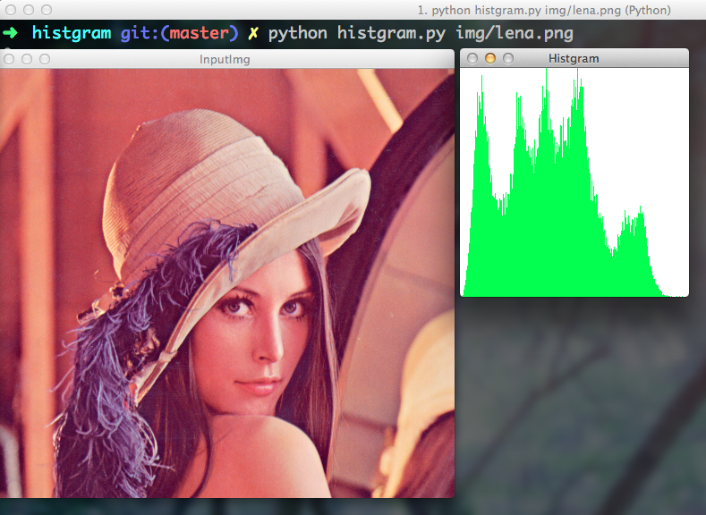

Simple Histgram Generator
=========

Simple histgram generator
## Usage

    $ python histgram.py [path/to/img]

## Requirement
OpenCV 2.4.*

NumPy

## Installation

    $ git clone git@github.com:hmiha/histgram.git
    

